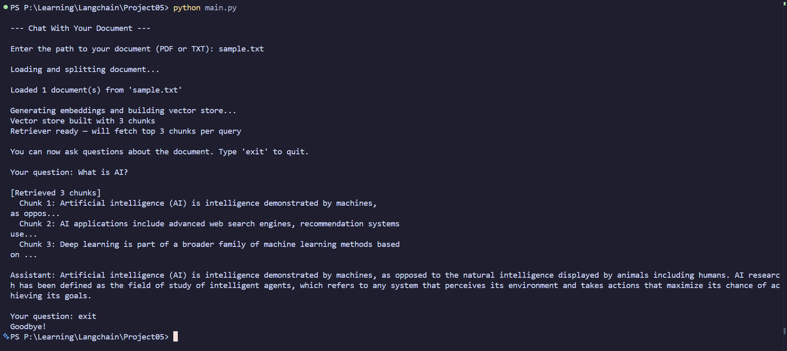

# Chat With Your Document

A clean, beginner-friendly LangChain project that lets you **chat with your own PDF or TXT files** using retrieval-augmented generation (RAG).

It:
- loads a document,
- splits it into chunks,
- embeds those chunks with OpenAI embeddings,
- stores vectors in FAISS,
- retrieves relevant chunks for each question,
- answers using an OpenAI chat model constrained to retrieved context.

---
## Output

### Video Output
https://github.com/user-attachments/assets/4e146c43-89f9-4101-9a71-da08621504cb

### Screenshot Output


---
## Features

- Supports `.pdf` and `.txt` documents
- Uses `RecursiveCharacterTextSplitter` for chunking
- Uses OpenAI `text-embedding-3-small` for embeddings
- Uses FAISS as an in-memory vector store
- Retrieves top `k=3` chunks per query
- Uses a prompt that instructs the model to answer only from context
- Interactive terminal chat loop

---

## Project Structure

```text
.
├── main.py          # CLI entrypoint and chat loop
├── loader.py        # File loading (PDF/TXT)
├── splitter.py      # Document chunking
├── vectorstore.py   # Embeddings + FAISS retriever setup
├── chain.py         # Prompt + LLM + retrieval chain wiring
└── assets/
```

---

## How It Works

### 1) Load
`loader.py` chooses:
- `PyPDFLoader` for `.pdf`
- `TextLoader` for `.txt`

Then it loads the document into LangChain `Document` objects.

### 2) Split
`splitter.py` uses:
- `chunk_size=1000`
- `chunk_overlap=200`

to create overlapping chunks for better recall.

### 3) Embed + Store
`vectorstore.py`:
- creates embeddings with `OpenAIEmbeddings(model="text-embedding-3-small")`
- builds an in-memory FAISS index from chunks.

### 4) Retrieve + Answer
`chain.py`:
- retrieves top chunks per question,
- formats them as context,
- sends prompt + question to `ChatOpenAI(model="gpt-3.5-turbo", temperature=0)`,
- returns a plain string answer.

### 5) Interactive Chat
`main.py`:
- asks for a document path,
- builds the pipeline,
- loops over questions until you type `exit`.

---

## Requirements

- Python 3.9+
- An OpenAI API key

Python packages used by the code:
- `langchain`
- `langchain-community`
- `langchain-openai`
- `langchain-text-splitters`
- `faiss-cpu`
- `pypdf`
- `python-dotenv`

---

## Setup

### 1) Clone and open the project

```bash
git clone https://github.com/pragyandhar/Langchain-P5-Embeddings-and-Vector-Stores.git
cd Langchain-P5-Embeddings-and-Vector-Stores
```

### 2) Create and activate a virtual environment

```bash
python -m venv .venv
source .venv/bin/activate
```

### 3) Install dependencies

```bash
pip install -U langchain langchain-community langchain-openai langchain-text-splitters faiss-cpu pypdf python-dotenv
```

### 4) Add your API key

Create a `.env` file in the project root:

```env
OPENAI_API_KEY=your_openai_api_key_here
```

---

## Usage

Run:

```bash
python main.py
```

You will be prompted:

```text
Enter the path to your document (PDF or TXT):
```

Example:

```text
Enter the path to your document (PDF or TXT): ./assets/my_notes.pdf
```

Then ask questions in the terminal. Type `exit` to quit.

---

## Example Session

```text
--- Chat With Your Document ---

Enter the path to your document (PDF or TXT): ./assets/example.txt

Loading and splitting document...
Loaded 1 document(s) from './assets/example.txt'

Generating embeddings and building vector store...
Vector store built with 12 chunks
Retriever ready — will fetch top 3 chunks per query

You can now ask questions about the document. Type 'exit' to quit.

Your question: What is the main topic?
[Retrieved 3 chunks]
  Chunk 1: ...
  Chunk 2: ...
  Chunk 3: ...

Assistant: ...
```

---

## Notes and Limitations

- The current loader only handles `.pdf` and `.txt`.
- Invalid file types are not explicitly handled yet (this can raise an error).
- FAISS store is in-memory only in this version (not persisted to disk).
- Chunk retrieval count defaults to `k=3`.
- The chain is intentionally restricted to retrieved context; if context is insufficient, answers may be short or unavailable.

---

## Quick Improvements You Can Add Next

- Add graceful error handling for unsupported file types and missing files.
- Persist and reload FAISS index for faster repeated runs.
- Add support for `.md`, `.docx`, and URLs.
- Add source citations (chunk/page metadata) in final answers.
- Stream model responses token-by-token in CLI.

---

## License

No license file is currently included in this repository. Add a `LICENSE` file if you want to define usage terms.
